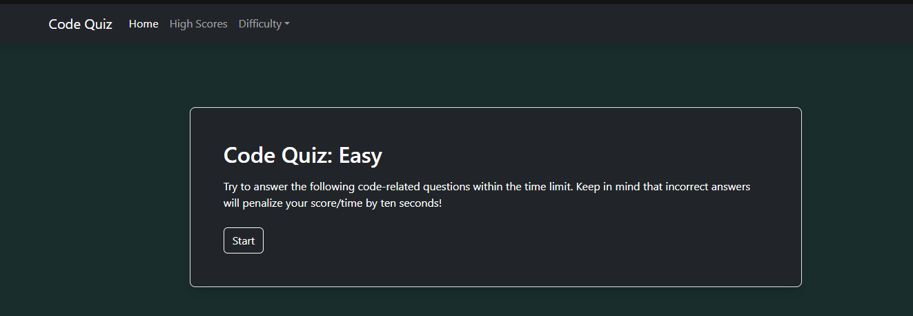
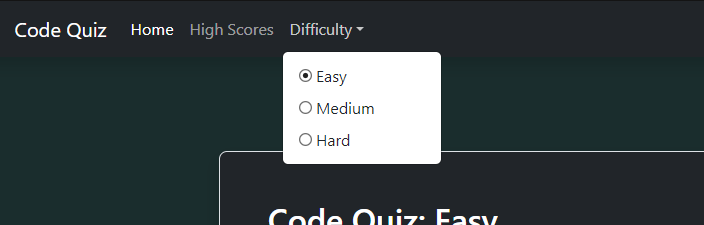
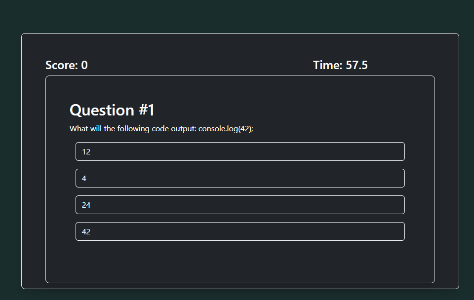
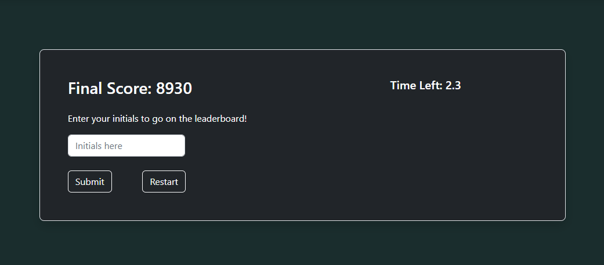
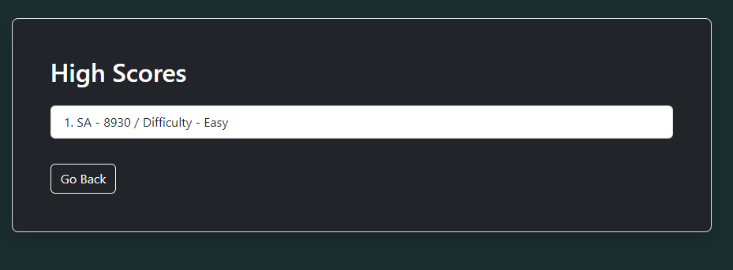

# Code Quiz

## Description

This project is a JavaScrip coding quiz. There are 3 seperate difficulties each with a time limit of 60 seconds. Every wrong answer will dock 10 seconds! At the end of each quiz, you may save your high score.

I built this project to better learn how javascript interacts with html, as well as local storage. I wanted to make a clean JavaScript quiz for people to test their knowledge and see how high they can score. I was able to learn a lot of bootstrap and jquery commands/classes. This project also helped me learn how to organize a big file.

## Installation

N/A

## Usage

This will be the default screen when the website is loaded.

You may select your difficulty from the drop down in the top left, then click "Start"

After clicking "Start you will be given 60 seconds to answer 10 questions. Each question right will give you additional score based on your time left, however each question wrong will dock 10 seconds!

After you finish, this game end screen will show. You may enter your initials and submit your score, or restart.

After submitting your score, you may view other scores and go back to the home screen.

At any time you may switch the difficulty or view high scores.

## Credits

N/A

## License

None